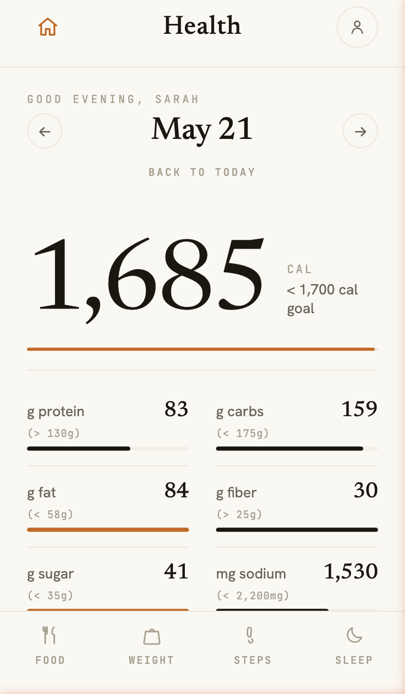
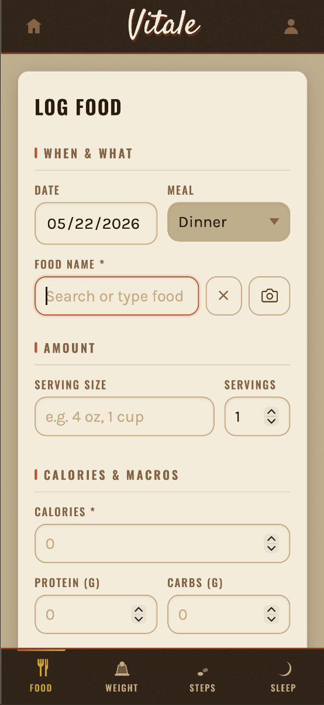
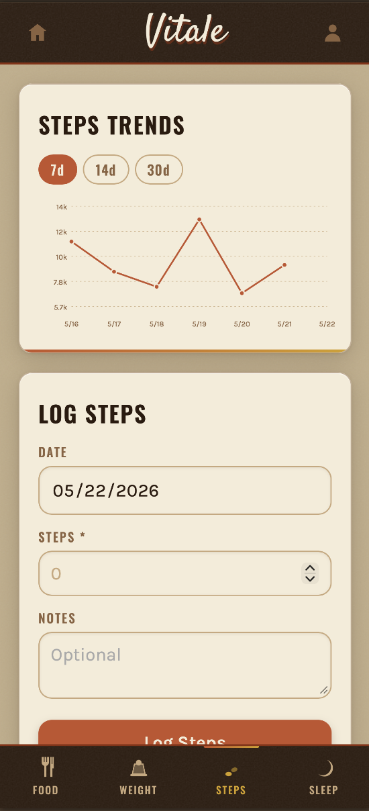
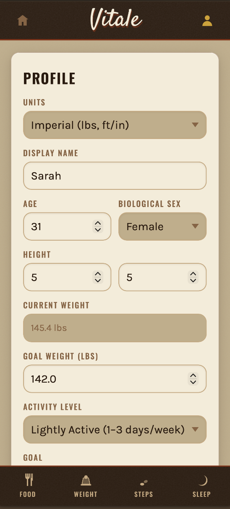

# Vitale Health Tracker

A personal health tracking web app for logging food, weight, steps, and sleep. Built to run on a standard shared PHP/MySQL host with no build tools or dependencies required.

## Overview

Vitale lets you track daily nutrition against customizable macro and calorie goals, log body weight over time, and record activity metrics like steps and sleep. A barcode scanner lets you look up packaged foods via OpenFoodFacts. Food search pulls from both the USDA FoodData Central database and OpenFoodFacts, with results cached locally to reduce API calls.

  
  

  
  

The app is single-user by design but supports multiple accounts — each user has their own data and goals. Authentication uses bcrypt password hashing with email verification and password reset flows.

## Technical Notes

- **Frontend:** Vanilla JavaScript SPA with hash-based routing. No frameworks, no build step. All JS is organized into views, components, and a shared API client.
- **Backend:** PHP 8+, structured as a lightweight JSON API. Each endpoint is a single PHP file routed through `api/index.php`.
- **Database:** MySQL with a single schema file covering all tables.
- **Food data:** Searches the USDA FoodData Central API and OpenFoodFacts (no key required). USDA results are cached in a local `usda_cache` table.
- **Barcode scanning:** Uses the browser's native `BarcodeDetector` API where supported, with a fallback to a manual entry prompt.
- **Email:** Password reset and email verification use PHP's `mail()`. On shared hosts, SMTP configuration may be required depending on the host.
- **Hosting:** Tested on Hostinger shared hosting. Should work on any host running PHP 8+ and MySQL 5.7+.

## Installation

- **Clone the repo** to your local machine or directly to your server.

- **Set up the database** — create a MySQL database, then import `db/schema.sql`. This creates all tables and loads a sample user (`sarah@example.com` / `Demo1234!`) with two weeks of data so you can see the app in action right away.

- **Configure the database connection** — copy `config/db..sample.php` to `config/db.php` and fill in your database credentials. Also add your USDA API key (free at `fdc.nal.usda.gov`).

- **Point your web root to `public_html/`** — the `config/` and `db/` directories sit outside the web root and are never served over HTTP.

- **Register your account** — visit the app, register with your email, and verify your address. You can then delete the sample user from the database if you no longer need it.

- **Configure PHP mail (if needed)** — on some shared hosts, email delivery requires configuring SMTP. Check your host's documentation for the recommended approach.